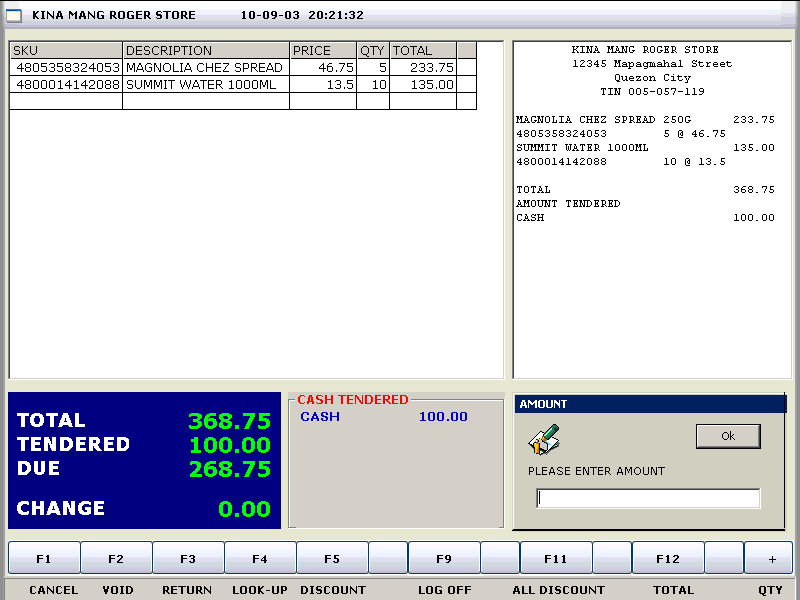



## POS/Cash Register

### Description

This is a simple POS or Cash Register w/ Inventory. It can monitor item stock and reports are available. It used ADO, Data Environment and Data Report. A learning purpose to all beginner. Hope you like it!
 
### More Info
 

             |
---                |---
**Submitted On**   |2002-11-20 11:57:40
**By**             |[PinoyCoder](https://github.com/Planet-Source-Code/PSCIndex/blob/master/ByAuthor/pinoycoder.md)
**Level**          |Beginner
**User Rating**    |4.7 (140 globes from 30 users)
**Compatibility**  |VB 5\.0, VB 6\.0, VBA MS Access
**Category**       |[Complete Applications](https://github.com/Planet-Source-Code/PSCIndex/blob/master/ByCategory/complete-applications__1-27.md)
**World**          |[Visual Basic](https://github.com/Planet-Source-Code/PSCIndex/blob/master/ByWorld/visual-basic.md)
**Archive File**   |[POS\_Cash\_R1696021182004\.zip](https://github.com/Planet-Source-Code/pinoycoder-pos-cash-register__1-50876/archive/master.zip)

